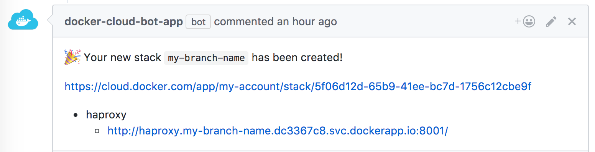

# docker-cloud-bot
> a GitHub App built with [probot](https://github.com/probot/probot)

A bot to manage your _Docker cloud stacks_ (create, update, delete) based on PR lifecycle.



## Setup

```
# Set the APP_ID and WEBHOOK_SECRET environment variables with the corresponding values for the bot
# Set the DOCKERCLOUD_USER and DOCKERCLOUD_APIKEY environment variables for Docker Cloud integration
# Ask the owner for the app private key to use the bot

# Install dependencies
npm install

# Run the bot locally, using localtunnel
npm start
```

## Configuration
To configure the bot, you need to provide a `.github/docker-cloud-config.yml` in your project repository where you install the bot. Check `docker-cloud-config.yml.example` to see all possible configuration values.

## Features
* create a stack (defined in the bot config) based on a CI "status change" trigger
* redeploy the stack for each new CI "status change"
* delete the stack if the PR is merged/closed
* get notifications as comments in PR
  * provide the service URLs to the PR after the stack has been created
  * notify when stack is redeployed
  * notify when stack is scheduled for termination

## Limitations
There are currently some limitations in terms of configuration and other possible features.

> If you happen to be using this bot and you need extra features or maybe something doesn't quite work for you, please let us know and we'll try to find a solution.

* you can define only one _docker cloud service_ in your stack template.
* the stack template configuration must be provided in the `.github/docker-cloud-config.yml` in plain text. For instance if you need e.g. environment variables with sensible credentials, you can't really do much besides providing them as plain text.
* bot comments are not customisable.
* it's assumed that the docker image tag is the same as the github branch.

## Deployment
See [docs/deploy.md](docs/deploy.md) if you would like to run your own instance of this plugin.

> Make sure to get the pem certificate as a one liner, if you pass it as an _environment variable_.

```bash
$ awk 'NF {sub(/\r/, ""); printf "%s\\n",$0;}' cert-name.pem
```
